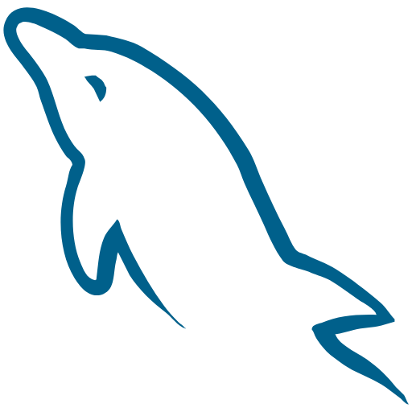
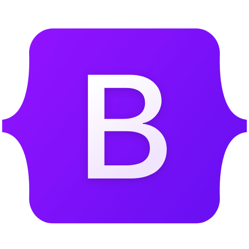

<h2> Olá, bem vindo(a) ao meu perfil! </h2>

<ul>
  <li>😊 Apaixonado por tecnologia. </li>
  <li>🎓 Formado em Análises e Desenvolvimento de Sistemas.</li>
  <li>📊 Cursando Pós em Ciência de Dados na Faculdade Líbano e Escola DNC</li>
  <li>🚀 Estudo também sobre técnologias emergentes como IA, Low-Code</li>
  <li>🖥️ Materializando ideias em códigos desde 2019!</li>
</ul>

<h6> Se você estava comigo no perfil do GitHub <strong><em>leo-allves</em></strong> desde de 2019, infelizmente ele não está mais disponível. Seja bem-vindo ao novo 🫡</h6>

##

  
  

 
  

 
  
  
  
  
  
  
  
  
         
    
  

  
  ##

  

 
  
  
  
  
  
   ##
  

