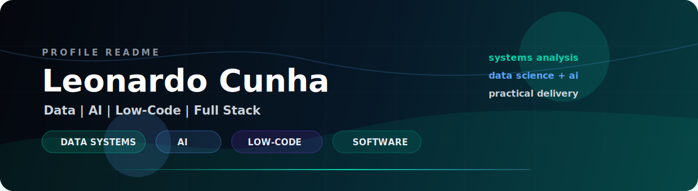
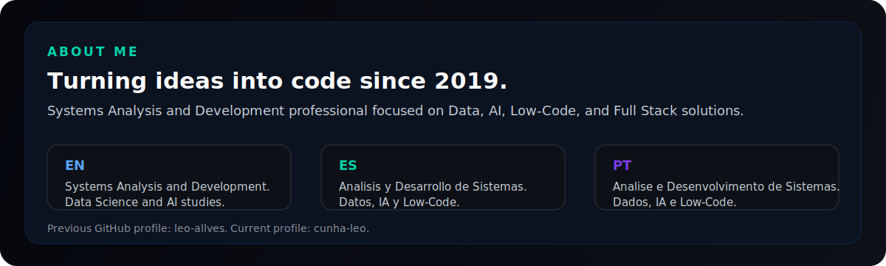
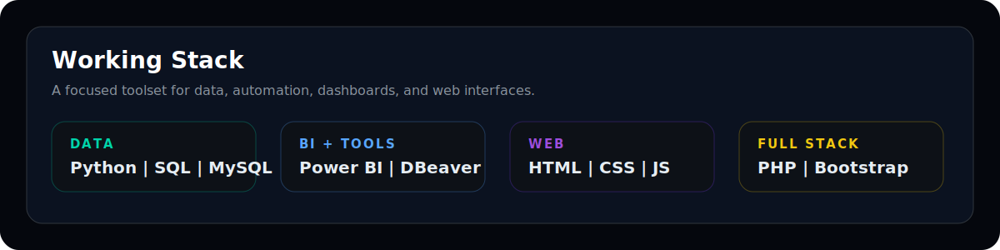

  

  
  
  
  

  
  
  

  

  

  

  <picture>
    <source
      media="(prefers-color-scheme: dark)"
      srcset="https://raw.githubusercontent.com/cunha-leo/cunha-leo/output/github-contribution-grid-snake-dark.svg"
    />
    <source
      media="(prefers-color-scheme: light)"
      srcset="https://raw.githubusercontent.com/cunha-leo/cunha-leo/output/github-contribution-grid-snake.svg"
    />
    
  </picture>

